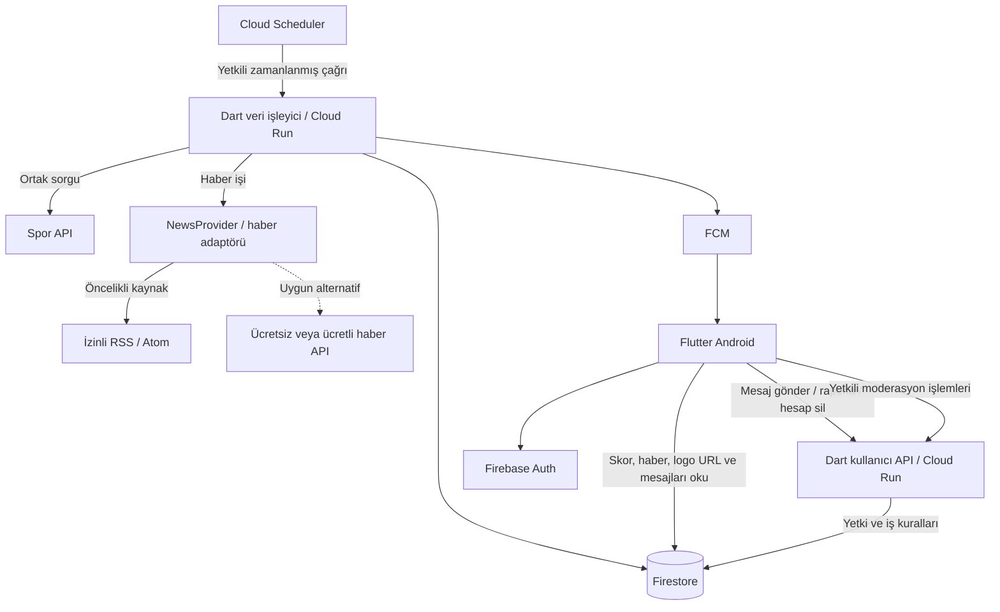

# Futbolix — Sistem Mimarisi ve Uygulama Planı

**Sürüm:** 4.3 · **Durum:** geliştirmede kullanılacak ana plan.

**Güncel bütçe kararı:** Ücretli spor/haber API aboneliği alınmayacak. ESPN dahil ücretsiz kaynaklar doğrulanacak; geliştirme örnek veriyle başlayacak. Bütün hedef sporların ücretsiz ve güvenilir canlı veriyle karşılanabildiği henüz doğrulanmadı. [Ücretsiz veri ve GitHub hazırlığı](FUTBOLIX-UCRETSIZ-VERI-VE-GITHUB-HAZIRLIK.md).

**Kaynak seçimi eki:** [Skor API'si ve RSS/haber seçenekleri](FUTBOLIX-API-HIZ-VE-KAYNAK-KARSILASTIRMASI.md). Çoklu spor kotası, hızlı skor için işleyici seçimi ve izinli RSS/ücretsiz API alternatifleri bu ekte değerlendirilir; kaynakların üretim erişimi ve kullanım izinleri henüz kesinleşmemiştir.

Sistem mimarisi, yol haritası ve işaretlenebilir görevler bu dosyada birlikte tutulur. Görevler gün/tarih ve kişi ataması olmadan, bağımlılık sırasına göre düzenlenmiştir. Önceki takvimli planlar tarihsel referanstır. Kutular iş tamamlanıp doğrulanınca işaretlenir; bu belge hazırlanırken hiçbir uygulama görevi tamamlandı sayılmamıştır.

## 1. Projenin amacı ve mevcut durum

Futbolix; farklı sporların canlı skorlarını, fikstürlerini, sıralamalarını, takım/sporcu bilgilerini ve haberlerini sunan Android uygulamasıdır. Kullanıcılar favorilerini takip eder, bildirim alır ve maç devam ederken ortak sohbet odasında yazışır.

UI/UX hazır. Tercih edilen teknolojiler Flutter, Dart backend ve Firebase. Tasarım dosyaları ve tamamlanmış uygulama kodu henüz incelenmedi; bu plan çalışır sistemin doğrulandığı anlamına gelmez.

**İçerik kararı:** Skorlar spor API'sinden alınacak. Haberlerde öncelik, ticari mobil kullanımına izin verilen RSS/Atom akışlarıdır; uygun ücretsiz haber API'leri de değerlendirilecek. İzin, kapsam veya kota karşılanmazsa ücretli haber API'si alternatif olacak. Manuel haber editörü ve ayrı web yönetim uygulaması başlangıç kapsamından çıkarıldı. Canlı sohbet moderasyonu, aynı Flutter uygulamasında yalnız yetkili hesapların kullanabildiği küçük ekranlarda yapılacak.

**Uygunluk değerlendirmesi:** Özellik bazlı Flutter yapısı, modüllere ayrılmış tek Dart backend ve yönetilen Firebase servisleri bu proje için uygun bir başlangıçtır. Gereksiz ayrı sunucular ve veritabanları eklemeden çoklu spor, favori, bildirim ve sohbet ihtiyaçlarını karşılayabilir. Veri kapsamı, güvenlik ve yük testleriyle doğrulanmalıdır.

## 2. Sistem mimarimiz

| Parça | Teknoloji | Görevi ve seçilme nedeni |
|---|---|---|
| Mobil uygulama | Flutter / Dart | Hazır tasarımları Android ekranlarına dönüştürmek; ortak bileşenleri tekrar kullanmak |
| Ekran yönetimi | Riverpod + go_router | Ekran durumlarını ve sayfalar arası geçişleri düzenlemek |
| Backend | Dart HTTP servisi | Spor API ve RSS/Atom/haber API verisini ortak modellere dönüştürmek, sohbet ve yetki kurallarını uygulamak |
| Haber kaynağı katmanı | NewsProvider + RSS/Atom veya API adaptörü | Haber kaynağını değiştirirken mobil ekranları ve veritabanı modelini korumak |
| Spor kaynağı katmanı | SportsProvider + örnek veri / doğrulanmış kaynak adaptörü | ESPN veya başka kaynakları ortak modele çevirmek; desteklenen lig ve özellikleri açıkça bildirmek |
| Backend barındırma | Cloud Run | Dart kodunu yönetilen ortamda çalıştırmak; ayrı sunucu bakımını azaltmak |
| Kullanıcı girişi | Firebase Authentication | Google/e-posta ile giriş ve hesap yönetimi |
| Veritabanı | Cloud Firestore | Ortak spor verileri, izinli haber kartları, favoriler, kullanıcı tercihleri ve sohbet mesajları |
| Bildirimler | Firebase Cloud Messaging | Favori maç başlangıcı/bitişi ve seçilen spor olaylarında push göndermek |
| Zamanlanmış işler | Cloud Scheduler | Spor/haber için ayrı güncelleme aralıkları, bekleyen bildirimlerin yeniden denenmesi ve temizlik |
| Sohbet moderasyonu | Flutter uygulamasında yetkili ekranlar | Şikâyet inceleme, mesaj kaldırma, kullanıcı susturma ve oda kapatma; ayrı web paneli gerektirmez |
| Güvenlik/izleme | App Check, IAM, Secret Manager, Crashlytics | Uygulama/servis erişimini korumak, API anahtarını saklamak, hataları izlemek |

### Sistem nasıl çalışacak?



Backend, spor verisini ortak olarak çeker. Aynı maçı 50 kişi izlediğinde dış sağlayıcıya 50 ayrı sorgu yapılmaz. Firestore'a yalnız değişen veriler yazılır; uygulama yalnız açık ekranın ihtiyaç duyduğu kayıtları dinler.

### Haberler nasıl gelecek?

Haber akışı: **İzinli RSS/Atom veya uygun haber API'si → Dart NewsProvider adaptörü → ortak NewsArticle modeli → Firestore → Flutter haber kartı → orijinal haber bağlantısı.** Skor paketinin haberleri de içerdiği varsayılmaz.

**Öncelik sırası:** İzinli ücretsiz RSS/Atom → kapsamı ve ticari kullanım izni uygun ücretsiz API → gerekirse ücretli API. RSS ve API adaptörleri aynı modeli üretir; hepsini başlangıçta geliştirmek gerekmez. Önce seçilen tek kaynak çalıştırılır. Kaynak değişimi ayar ve adaptör düzeyinde yapılır; yeni veritabanı, sunucu veya yönetim paneli gerekmez.

- RSS için ilk aday NTV Spor'un hazır spor akışlarıdır; SonDakika.com alternatif olarak değerlendirilir. Çalışan akış, ücretsiz yeniden yayın izni anlamına gelmez. Mobil kullanım, izinli alanlar, saklama ve görseller doğrulanmadan kaynak üretimde açılmaz.
- Backend haberleri kullanıcıdan bağımsız ortak olarak alır. RSS için başlangıç 10–15 dakikadır; yayıncı koşulları uygunsa 5 dakika değerlendirilebilir. Ücretsiz API'de sorgu aralığı ve sayfalama kotaya göre seçilir. Örneğin tek sorguyu 20 dakikada bir çalıştırmak günlük 72 istektir; ek sayfalar bunu artırır. Spor ve haber işleri birbirini beklemez.
- Ortak haber modeli: `id`, `sourceId`, `sourceItemId`, `sourceUrl`, `title`, izinli `summary`/`imageUrl`, `publishedAt`, varsa `sourceUpdatedAt`, `fetchedAt`, `sport` ve doğrulanmış takım etiketleri. RSS GUID/Atom ID veya standartlaştırılmış URL ile tekrarlar önlenir. Aynı haberin güncellenmesi yeni kart üretmez.
- Transfer ve diğer spor haberleri kaynak kapsamına göre gelir. Kaynak kategorisi tercih edilir; belirsiz takım/branş zorla atanmaz. Transfer iddiası kesinleşmiş transfer gibi gösterilmez.
- Başlangıç ekranı izinli başlık/özet, kaynak ve tarih gösterir; dokununca orijinal haber tarayıcıda/Android Custom Tab'de açılır. Görsel izni yoksa görselsiz kart kullanılır. Tam yazıyı kazıma/kopyalama başlangıç kapsamı değildir.
- Kaynak listesi, izinli alanlar, yenileme aralığı, saklama süresi ve açık/kapalı durumu sunucu tarafında yapılandırılır. API anahtarı gerekiyorsa Secret Manager'da kalır. Sorgulanacak adresleri kullanıcı belirleyemez; izinli kaynak/redirect hedefleri sınırlandırılır, XML dış varlık çözümleme kapalı tutulur ve gelen HTML çalıştırılmaz.
- Kaynak destekliyorsa ETag/Last-Modified ile koşullu istek yapılır. Zaman aşımı, yanıt boyutu sınırı, sınırlı yeniden deneme ve artan bekleme uygulanır. Kesintide izin verilen son içerik güncellik bilgisiyle gösterilir; yayıncının erişim veya kaldırma talepleri işlenir. Bir haberin RSS listesinden düşmesi tek başına silindiği anlamına gelmez.

**Mimari etkisi:** Haber alma katmanına RSS/Atom okuyucu ve ortak kaynak arayüzü eklenir. Flutter, Dart, Cloud Run, Firestore, Auth ve FCM omurgası korunur. Bu değişiklik skor/bildirim hızını artırmaz veya azaltmaz; bunlar ayrı veri ve gönderim işleriyle ölçülür.

### Kulüp logoları ve haber görselleri

Takım/lig logosunun URL'si spor API'sindeki takım/organizasyon kaydından; haber görselinin URL'si izinli RSS/Atom veya haber API kaydından alınır. Firestore'da ilgili kayda bağlantı ve kaynak bilgisi eklenir. Flutter görseli izin verilen kaynaktan yükler ve sınırlı cihaz önbelleği kullanır. Görsel izni yoksa haber kartı görselsizdir; eksik/bozuk görsel için varsayılan görünüm kullanılır.

Başlangıçta logoların kopyasını Cloud Storage'a yüklemek gerekmez. Kaynak bağlantısı anahtar veya süreli erişim gerektiriyorsa anahtar APK'ya konmaz; izinlere uygun backend erişimi ya da başka kaynak çözümü seçilir. Görselin uygulamada gösterilmesi ve önbelleklenmesi için sağlayıcı/varlık hakları doğrulanır; API'de URL bulunması tek başına kullanım izni sayılmaz.

### Gol verisi ve bildirim hızı

Akış: **Gol → sağlayıcının veriyi güncellemesi → Dart backend → Firestore skor/olay kaydı → açık ekranda güncelleme ve FCM bildirimi.**

Toplam gecikme; sağlayıcının gecikmesi, bizim sorguyu bekleme süremiz ve işleme/iletim sürelerinin toplamıdır. Sabit iki dakikalık sorgulama hızlı gol bildirimi için kabul edilmiş hedef değildir. Sağlayıcının gerçek tazeliği canlı maçta ölçülür; yenileme aralığı bundan sonra kota ve beklentiyle birlikte seçilir. Sağlayıcı daha yavaş güncelleniyorsa daha sık sorgulama tek başına çözüm olmaz.

Cloud Scheduler temel periyodik tetikleyicidir. Dakika altı yenileme gerekli çıkarsa sağlayıcının webhook/stream desteği veya ayrı maliyetlendirilmiş kontrollü worker değerlendirilir. Bu destek mevcut pakette doğrulanmış değildir. İstek bazlı Cloud Run'da HTTP yanıtı döndükten sonra çalışan sonsuz döngü tasarlanmaz.

Bildirim işi skor/olay güncellemesiyle birlikte kalıcı kuyruğa kaydedilir. Senkronizasyon çağrısı içinde sınırlı gönderim denenir; kalan işler zamanlanmış göndericiyle tekrar ele alınır. Böylece her başarılı gol bildirimi ayrıca bir sonraki zamanlayıcı turunu beklemek zorunda kalmaz. Aynı olay tekrar işlendiğinde yeniden bildirim üretilmez; ilk veri yüklemesindeki eski goller ve VAR iptalleri ayrıca ele alınır. FCM teslimi ile açık ekrandaki skor güncellemesinin aynı anda gerçekleşeceği garanti edilmez.

**Tek backend kod tabanı, iki erişim sınırı:** Kullanıcı API'si token kontrolüyle mesaj/rapor gibi işlemleri alır. Zamanlanmış veri işleyici yalnız yetkili servis hesabının çağırabildiği ayrı Cloud Run dağıtımıdır. İkisi aynı Dart projesini kullanır.

### Dosyalama

```text
futbolix/
  apps/
    mobile/
      pubspec.yaml
      lib/
        app/                     # başlangıç, yönlendirme, tema
        core/                    # ayarlar, hata, zaman, izleme
        shared/widgets/          # gerçekten ortak bileşenler
        features/
          auth/
          home/
          sports/
          competitions/
          events/
            presentation/        # ekran, widget, controller
            data/                # repository ve veri bağlantısı
          participants/
          favorites/
          news/
          notifications/
          chat/
            presentation/
            data/
          moderation/            # yalnız yetkili hesapların chat işlemleri
          settings/
      test/
      integration_test/
    backend/
      pubspec.yaml
      bin/server.dart
      lib/src/
        http/                    # yönlendirme, token, doğrulama
        modules/                 # spor, haber, chat, moderasyon, kullanıcı
        integrations/
          sports/                # spor API adaptörleri
          news/                  # NewsProvider, RSS/Atom ve seçilirse API adaptörü
          firebase/              # Firebase bağlantıları
        repositories/            # veri okuma/yazma
        jobs/                    # spor/haber güncelleme, gönderim, temizlik
      test/
      Dockerfile
  packages/domain_models/        # ortak saf Dart modelleri + pubspec.yaml
  contracts/                     # örnek JSON, HTTP ve durum eşlemeleri
  firebase/                      # erişim kuralları ve indeksler
  infra/                         # Cloud Run, Scheduler, IAM ayarları
  .github/workflows/             # otomatik kontroller
  docs/FUTBOLIX-PROJE-PLANI.md
```

`presentation` ve `data` ayrımı ihtiyacı olan **her özelliğe** uygulanır; yalnız örnekte açılan klasörlere özel değildir. Küçük özelliklerde gereksiz alt klasörler oluşturulmaz. Widget'lar doğrudan dış spor API'sine bağlanmaz. Ortak modellere Flutter UI veya sunucu sırları eklenmez.

Mobil akış: **Ekran → Controller → Repository → Firebase/backend**. Backend akışı: **HTTP veya zamanlanmış iş → ilgili modül → sağlayıcı adaptörü/veritabanı**. Spor ve haber için ayrı adaptör kullanılır. Haber ekranı kaynağın RSS mi JSON API mi olduğunu bilmez; ikisi aynı NewsArticle sözleşmesini üretir. Kaynak değiştiğinde gösterim izinleri yeniden değerlendirilir.

**Ücretsiz spor kaynağına geçiş:** Ekranlara ESPN adresi veya sağlayıcıya özel alan gömülmez. Backend'de lig/özellik kapsamı, son başarılı güncelleme, veri tazeliği ve kaynak kullanım durumu tutulur. Üretimde yalnız erişimi, kullanım koşulu ve kapsamı doğrulanan kaynak etkinleştirilir. 403/429 alınırsa sınırlı hata yönetimi uygulanır; erişim engeli aşılmaya çalışılmaz. Kaynak değişiminde maç kimlikleri eşlenmeden farklı sağlayıcıların skorları karıştırılmaz. Kaynağın ücretsiz olması sınırsız veya sürekli erişim anlamına gelmez.

### Çoklu spor verisi

Ortak etkinlik kaydı; kimlik, spor, organizasyon, sezon, katılımcılar, başlangıç, durum, skor ve son güncelleme bilgilerini taşır. Skor modeli sporuna göre farklıdır: futbolda gol/penaltı, basketbolda çeyrek/uzatma, voleybolda set, teniste oyun/set, F1'de sürücü sıralaması.

Sağlayıcı kimliği ile uygulamanın etkinlik kimliği ayrı tutulur; kaynak değişince favoriler ve sohbet kaybolmaz. Temel koleksiyonlar: `events`, `competitions`, `participants`, `standings`, `users`, `chatRooms`, `news`. Raporlar, roller, işlem kuyrukları ve kota sayaçları sunucuya özel tutulur.

Sık değişen skor özeti, büyük istatistik/olay ayrıntılarından ayrılır. Böylece bir gol güncellemesinde bütün maç ayrıntıları ve haberler yeniden okunmaz. `fetchedAt` ile kaynaktaki güncelleme zamanı varsa ayrı tutulur; başarılı API yanıtı verinin mutlaka taze olduğunu göstermez.

### Canlı sohbet

- Maçın doğrulanmış canlı durumunda açılır; devre/periyot arası ve uzatmada açık kalır. Bitiş/iptalde yazmaya kapanır. Takvim saati veya sabit 90 dakika kapanış ölçütü değildir.
- Veri eskiyse, maç askıdaysa veya durum bilinmiyorsa yazma duraklatılır. Açılış/kapanış dış API gecikmesinden etkilenebilir.
- Maç bitişi ve mesaj gönderimi sunucuda atomik kontrol edilir. Eski bir API cevabı bitmiş odayı yeniden açamaz; moderatör kilidi otomatik güncellemeyle kaldırılmaz.
- Mesaj backend üzerinden gönderilir; giriş, şart kabulü, yasak, oda durumu ve hız sınırı kontrol edilir. İstemci Firestore'a doğrudan mesaj yazamaz.
- Başlangıç önerisi: yalnız metin, en fazla 300 karakter, kullanıcı başına 5 saniyede bir mesaj. Tekrarlanan istek aynı mesajı yeniden oluşturmaz.
- Son 50 mesaj dinlenir; geçmiş sayfalı alınır. Ekrandan çıkınca dinleyici kapanır. Çevrimdışı mesaj maç bittikten sonra otomatik gönderilmez.
- Şikâyet, kullanıcı engelleme, moderatörün kaldırma/susturma ve oda kapatma işlemleri ilk sürüme dahildir. Sohbet mesajları için herkese push gönderilmez.
- Moderasyon ekranları normal kullanıcıya gösterilmez; asıl yetki kontrolü her işlemde backend'de yapılır. Kullanıcı kendi rolünü değiştiremez. İşlemler kayıt altına alınır; şikâyetleri inceleyecek bir sorumlu belirlenir.
- Önerilen saklama: bitişten sonra 24 saat salt okunur erişim, normal mesajlarda 7 gün sonra temizlik. Rapor kanıtı ve hesap silme politikası ayrıca belirlenir; süre kontrolü temizlik işinin zamanında çalışmasına bırakılmaz.

**Güvenlik kontrolü:** Mobil uygulama skor, rol ve moderasyon kayıtlarını doğrudan değiştiremez; yetkili işlemleri backend üzerinden ister. Kullanıcı yalnız izin verilen kendi verisine erişir. API anahtarı APK/Git içinde bulunmaz. Firebase Admin Dart desteği deneysel olduğundan token/App Check, Firestore işlemleri ve FCM bağlantısı ilk çalışan örnekte test edilir; çalışmayan güvenlik kontrolü atlanmaz.

## 3. Ücretsiz veri seçimi ve başlangıç maliyeti

**API abonelik hedefi 0 USD/ay.** Önceki Highlightly PRO/ULTRA önerileri aktif satın alma planı değildir. Kaynaklar test edilmeden “ESPN ile tüm sporlar ücretsiz çözüldü” kabul edilmez.

| Kaynak | Doğrulanan durum | Kullanım kararı |
|---|---|---|
| ESPN | Denenen Süper Lig ve NBA scoreboard adresleri bu ortamda 403 döndürdü. Genel kullanıma açık, destek taahhütlü ve ticari mobil kullanımı doğrulanmış ücretsiz API paketi tespit edilmedi. | Doğrulama adayı; tek üretim kaynağı olarak seçilmedi. 403 tüm kullanıcılar için kapalı olduğunu kanıtlamaz. |
| football-data.org Free | 12 futbol organizasyonu, gecikmeli skor/fikstür, puan tablosu ve 10 çağrı/dakika. Süper Lig ücretsiz listede yok. | Sınırlı futbol verisi için deneme adayı; bütün sporları ve canlı sohbet açılışını karşılayan kaynak değil. |
| Highlightly Basic | 100 istek/gün; erişilebilen özellikler ve hedef ligler hesapla test edilmeli. | Ücretsiz bağlantı denemesi; sürekli çoklu spor yayını için yeterli kabul edilmez. |
| TheSportsDB Free | Geliştirmede ücretsiz API; mağazada uygulama yayımlamak için şartlarında ücretli abonelik isteniyor. Canlı skorlar premium tarafta. | Sıfır abonelikli Google Play sürümünün veri çözümü olarak seçilmedi. |
| İzinli RSS/Atom / uygun ücretsiz haber API | Haber tarafında önceki yaklaşım geçerli; üretim izni ve kapsamı henüz kesinleşmedi. | İzin ücretsizse haber abonelik bedeli 0 olabilir. Ücretli alternatife otomatik geçilmez. |

Maç listesi, canlı skor, olaylar, kadro, puan durumu ve logolar her lig için ayrı doğrulanır. Ücretsiz kaynakta olmayan özellik veya spor, müşteri kararı olmadan sessizce kapsamdan çıkarılmaz. Gecikmeli sonuç verisinden anlık gol bildirimi ya da doğru zamanda sohbet açılışı garanti edilemez. Kaynakta taze maç durumu yoksa sohbet yazımı güvenli biçimde duraklatılır.

Dokuz sporu gün boyunca dakikada bir, tek sayfayla sorgulamak `9 × 1.440 = 12.960 istek/gün` yapar. Kullanıcı sayısından bağımsız bu hacim ücretsiz kotayı aşabilir. Aktif maçlara göre sorgulama, ortak önbellek ve seyrek fikstür yenilemesi uygulanır; bunlar veri veya kullanım hakkı eksikliğini çözmez.

**API ücreti 0 hedeflenmesi, toplam işletme giderinin 0 olması değildir.** Cloud Run, Firestore, loglama, ağ ve diğer servislerin gerçek kullanımı ayrıca ölçülür. İlk bulut kurulumunda bütçe/maliyet uyarıları, kota ve kullanım sınırları ayarlanır; bütçe uyarısı tek başına harcamayı durdurmaz. Sohbet okuma/yazma tüketimi ayrı izlenir. Ücretli paket veya lisans kullanıcı kararı olmadan alınmaz.

Kaynaklar: [football-data fiyat](https://www.football-data.org/pricing), [ücretsiz ligler](https://www.football-data.org/coverage), [Highlightly](https://highlightly.net/sport-api/), [TheSportsDB ücretsiz API](https://www.thesportsdb.com/free_sports_api), [TheSportsDB kullanım şartları](https://www.thesportsdb.com/docs_terms_of_use.php). ESPN kontrol adresleri ve erişim sonuçları ücretsiz veri ekinde kayıtlıdır.

## 4. Yol haritası ve işaretlenebilir görevler

**İlk hedef:** Hazır UI/UX'i Flutter'a geçirip telefonda açılan, ekranları arasında gezilebilen bir Futbolix oluşturmak. İlk aşamada örnek veri kullanacağız; gerçek veri ve kalıcı kayıt sonraki aşamalarda bağlanacak.

Sıra: **Ekranlar ve tıklamalar → veri kaynaklarını doğrulama → backend/Firebase → gerçek skor ve haberler → hesap/favoriler → bildirimler → sohbet → test ve teslim.** Kaynak kontrolünü ekranlar hazırlanırken başlatın; izin veya eksik veri sorununu bütün arayüz bitene kadar bekletmeyin. Gün ve kişi ataması yoktur.

Görevler sadeleştirilip yeniden numaralandırıldı: **T01–T42**. Eski T01–T54 numaralarıyla birebir eşleşmez. Güvenlik, veri saklama ve kaynak kullanımı ayrıntıları yukarıdaki mimari bölümünde geçerliliğini korur.

### Aşama 1 — Flutter ekranlarını ve tıklamaları hazırla

- [ ] T01 — Flutter projesini ve temel klasörleri oluştur; uygulamayı Android cihazda aç.
- [ ] T02 — Tasarımdaki renkleri, yazı stillerini, butonları ve ortak kartları oluştur.
- [ ] T03 — Alt menüyü, sayfa geçişlerini ve geri tuşunu çalıştır.
- [ ] T04 — Ana sayfa ve maç listesini örnek verilerle oluştur; spor, lig, tarih ve canlı filtrelerini çalıştır.
- [ ] T05 — Maça basınca ayrıntıyı aç; skor, takım/sporcu, fikstür ve puan durumu ekranlarını örnek verilerle göster.
- [ ] T06 — Haber listesi, favoriler ve ayarlar ekranlarını hazırla; haber kartı ve favori yıldızı gibi tıklamaları çalıştır.
- [ ] T07 — Giriş/kayıt ve maç sohbeti ekranlarını hazırla; form kontrollerini ve örnek mesaj görünümünü çalıştır.
- [ ] T08 — Tasarımdaki tıklanabilir alanları cihazda tek tek dene; yükleniyor, boş liste ve hata görünümlerini ekle.

**Bittiğinde:** Telefonda gezilebilen bir uygulama var. Örnek veriler ekran koduna dağılmaz; aynı veri arayüzü daha sonra gerçek kaynağa bağlanır. Favori seçimi ve örnek sohbet bu aşamada gerçek hesapta saklanmış sayılmaz.

### Aşama 2 — Ekranları yaparken veri kaynaklarını doğrula

- [ ] T09 — Gösterilecek spor ve ligleri listele; tasarımdaki skor, istatistik ve logo alanlarının API'de bulunduğunu kontrol et. Eksikleri kaydet.
- [ ] T10 — ESPN ve diğer ücretsiz kaynaklarda futbol/basketbol/voleybol erişimini, kullanım iznini, gecikmeyi ve kotayı doğrula; her ligde sağlanabilen özellikleri kaydet. Doğrulanmayan kaynağı üretimde açma.
- [ ] T11 — Haber için önce izinli RSS/Atom, sonra uygun ücretsiz API'yi değerlendir; Türkçe spor/transfer kapsamını ve mobil kullanım/görsel izinlerini netleştir.
- [ ] T12 — Kaynakları ve bütçeyi kaydet; müşteriyle kapsamı ve gecikme beklentisini netleştir. Play hesabının yayın erişimini de şimdiden kontrol et.

**Bittiğinde:** Hangi ekrana hangi gerçek verinin geleceği belli. Eksik kapsam veya izin çözülmeden ilgili özellik tamamlandı sayılmaz. Bu aşama, ilk ekranlar hazırlanırken yürütülebilir.

### Aşama 3 — Firebase ve Dart backend'i bağla

- [ ] T13 — Dart backend ve ortak model paketini oluştur; otomatik analiz, test ve derleme kontrollerini kur.
- [ ] T14 — Geliştirme/üretim ortamlarını, Firebase ve Cloud Run bağlantılarını kur; anahtarları sunucuda sakla. İlk kurulumda Cloud Run/Firestore/log maliyet takibini ve bütçe uyarılarını aç.
- [ ] T15 — Maç, spora özel skor, haber ve sohbet modellerini oluştur; sağlayıcı kimliklerini uygulama kimlikleriyle eşleştir.
- [ ] T16 — Giriş/yetki kontrolünü ve Firestore erişim kurallarını kur; kullanıcının skor veya rol değiştiremediğini test et. Dart üzerinden App Check, atomik işlem ve FCM bağlantısını doğrula.
- [ ] T17 — Bir gerçek maçı API → Dart → Firestore → Flutter akışında göster.
- [ ] T18 — Spor ve haber yenileme işlerini ayrı kur; kota kontrolü, çakışmayı önleme, hata kaydı ve sınırlı yeniden denemeyi ekle.

**Bittiğinde:** Örnek veriyle hazırlanan ekranlardan en az biri güvenli biçimde gerçek veri gösteriyor.

### Aşama 4 — Gerçek skorları, haberleri ve görselleri göster

- [ ] T19 — Maç listesi, fikstür, filtreler ve puan durumunu gerçek veriye bağla; tüm sayfaların alındığını kontrol et.
- [ ] T20 — Maç ayrıntılarını ve takım/sporcu ekranlarını bağla; her sporun skorunu doğru göster. Kaynakta olmayan alanları uydurma değerlerle doldurma.
- [ ] T21 — Skor değişikliklerini ekrana yansıt; eski veri, ertelenme, iptal ve skor düzeltmesini işle.
- [ ] T22 — Seçilen RSS/Atom veya haber API adaptörünü bağla; haberleri ortak modele çevir, tekrarları önle ve kaynak kurallarına uygun sakla.
- [ ] T23 — Haber kartında izinli başlık/özet, kaynak ve tarihi göster; dokununca orijinal haberi aç. Transfer ve spor etiketlerini kontrol et.
- [ ] T24 — İzinli logo/görselleri göster; görsel yoksa uygun görünümü kullan. Kaynak kesintisini, bozuk haber akışını ve haber güncellemelerini test et.

**Bittiğinde:** Hazırlanan ekranlar gerçek spor ve haber verisi gösteriyor. Haber kaynağı RSS veya API olsa da ekran yapısı aynı kalıyor.

### Aşama 5 — Kullanıcı hesabını ve favorileri tamamla

- [ ] T25 — Giriş, kayıt, e-posta doğrulama, şifre yenileme ve çıkışı Firebase'e bağla; hesapsız erişim sınırlarını uygula.
- [ ] T26 — Favorileri kullanıcı hesabında sakla; uygulama kapanıp açılınca ve başka cihazdan girişte korunduğunu kontrol et.
- [ ] T27 — Bildirim tercihlerini ve ayarları kaydet; hesap silme ve uygulama dışı silme başvurusunu hazırla.
- [ ] T28 — Gerçek hesapla temel ekranları dene; yükleniyor, boş, hata, eski veri ve bağlantı yok durumlarını tamamla.

**Bittiğinde:** Giriş ve favoriler yalnız görsel olarak çalışmıyor; gerçek kullanıcı hesabında saklanıyor.

### Aşama 6 — Gol ve maç bildirimlerini çalıştır

- [ ] T29 — Bildirilecek olayları ve favori tercihlerini belirle; bildirim iznini ve cihaz kaydını bağla.
- [ ] T30 — Yeni olay için kalıcı bildirim işi oluştur; hemen gönderimi ve başarısız gönderimin tekrar denenmesini uygula.
- [ ] T31 — Aynı olayın tekrar bildirilmesini, ilk açılışta eski gollerin gönderilmesini ve VAR/skor düzeltmelerini test et.
- [ ] T32 — Ön/arka planda bildirimi ve dokununca doğru maça gitmeyi dene; API, açık skor ekranı ve push gecikmesini ayrı ölç.

**Bittiğinde:** Bildirim doğru kullanıcıya gidiyor; gerçek gecikme ölçülmüş. Her telefonda anında teslim garantisi verilmiyor.

### Aşama 7 — Canlı sohbeti ve moderasyonu tamamla

- [ ] T33 — Sohbeti gerçek maç durumuyla aç/kapat; devre/uzatma, askı, eski veri ve bitiş durumlarını uygula.
- [ ] T34 — Mesaj göndermeyi backend'e bağla; giriş, oda durumu, yasak, mesaj uzunluğu ve gönderim sıklığını kontrol et.
- [ ] T35 — Mesajları canlı göster; geçmişi sayfalı yükle, tekrarları önle ve ekrandan çıkınca dinlemeyi durdur.
- [ ] T36 — Şikâyet/engelleme ve yetkili moderasyon ekranlarını ekle; mesaj kaldırma, susturma ve oda kapatmayı çalıştır. Moderasyon sorumlusunu belirle.
- [ ] T37 — İki kullanıcı ve moderatörle dene; maç bitişinde mesaj gönderimini, çevrimdışı durumu, saklama/temizliği ve hesap silmeyi kontrol et.

**Bittiğinde:** Sohbet yalnız izin verilen maç durumlarında çalışıyor ve kötüye kullanım yönetilebiliyor.

### Aşama 8 — Kontrol et ve teslim et

- [ ] T38 — Tasarımdaki tüm ekranları ve kabul edilen özellikleri gerçek cihazda kontrol et; eksikleri gider ve müşteri kabulünü kaydet.
- [ ] T39 — Kaynak kesintisi/kota, zayıf internet ve yeniden bağlantıyı dene; 50 eşzamanlı sohbet izleyicisiyle gecikmeyi ve bulut tüketimini ölç. Sohbet okuma/yazma maliyetini ayrı raporla.
- [ ] T40 — Yetki, veri erişimi ve hesap silme kontrollerini tamamla; kota alarmlarını, yedek/geri yüklemeyi ve sürüm geri dönüşünü doğrula.
- [ ] T41 — İmzalı APK/AAB, mağaza görselleri, gizlilik/kullanım metinleri ve veri güvenliği beyanını hazırla; gereken Play test/yayın adımlarını uygula.
- [ ] T42 — Kod, tasarım sürümü, kurulum notları, kaynak izinleri, hesap sorumluları ve bilinen sınırlamaları teslim et.

**Bittiğinde:** Kabul edilen kapsam gerçek veride çalışıyor; kritik sorunlar kapatılmış ve teslim belgeleri hazır. Uygulama teslimi ile Google Play'de yayına çıkış ayrı takip edilir.


## 5. Notion'da kullanım ve tamamlanma kuralı

Bu Markdown dosyasını Notion'a içe aktarabilir veya bölümler halinde taşıyabilirsiniz. Başlıklar mimariyi ve aşamaları ayırır; `- [ ]` satırları işaretlenebilir görev biçimindedir. İçe aktarımda diyagram kod olarak kalırsa Mermaid kod bloğu olarak ayarlayın; diyagram olmadan da üstündeki açıklamalar mimariyi anlatır.

Bir görev kendi kabul ölçütü karşılanıp kontrol edildiğinde işaretlenir. İlk aşamadaki arayüz görevleri örnek verilerle tamamlanabilir; veri kaynağı araştırması kanıt ve kararla, entegrasyon görevleri gerçek bağlantı ve testle tamamlanır. Örnek veriyle çalışan ekran, gerçek veri entegrasyonunun bittiği anlamına gelmez. Tamamlanan göreve uygun PR/test/karar bağlantısını ekleyin.

Engelli görev için kısa not yeterlidir: `Eksik bilgi/erişim — etkilediği görev — sonraki adım`. Yeni isteklerde veri, maliyet ve emek etkisini kaydedin; görevi sessizce kapsamdan çıkarmayın. Takvim bu belgede görevlerin içine yazılmamıştır; bu, sözleşme süresini değiştirmez. Önceki saat tahminleri değişen haber/moderasyon kapsamına göre yeniden değerlendirilmelidir.

## Referanslar

16 Eylül 2026 tarihli araştırma ve önceki planların tutarlılık kontrolü esas alınmıştır; ücretli API entegrasyonu henüz test edilmedi.

[API paketleri](https://highlightly.net/sport-api/) · [API kapsamı ve uçları](https://highlightly.net/sport-api/documentation/) · [Flutter mimarisi](https://docs.flutter.dev/app-architecture/recommendations) · [Firebase Admin Dart durumu](https://firebase.google.com/docs/admin/setup) · [Firebase fiyatları](https://firebase.google.com/pricing) · [Cloud Run fiyatları](https://cloud.google.com/run/pricing) · [Play kayıt ücreti](https://support.google.com/googleplay/android-developer/answer/6112435?hl=en) · [Play test koşulları](https://support.google.com/googleplay/android-developer/answer/14151465?hl=en) · [Sohbet/UGC şartları](https://support.google.com/googleplay/android-developer/answer/9876937?hl=en)

[NTV Spor RSS](https://www.ntvspor.net/rss) · [NTV Spor kullanım koşulları](https://www.ntvspor.net/kullanim-kosullari) · [SonDakika.com kullanım şartları](https://www.sondakika.com/kullanim-sartlari/) · [The News API paketleri](https://www.thenewsapi.com/pricing) · [Haber/skor araştırması ve diğer kaynaklar](FUTBOLIX-API-HIZ-VE-KAYNAK-KARSILASTIRMASI.md)
